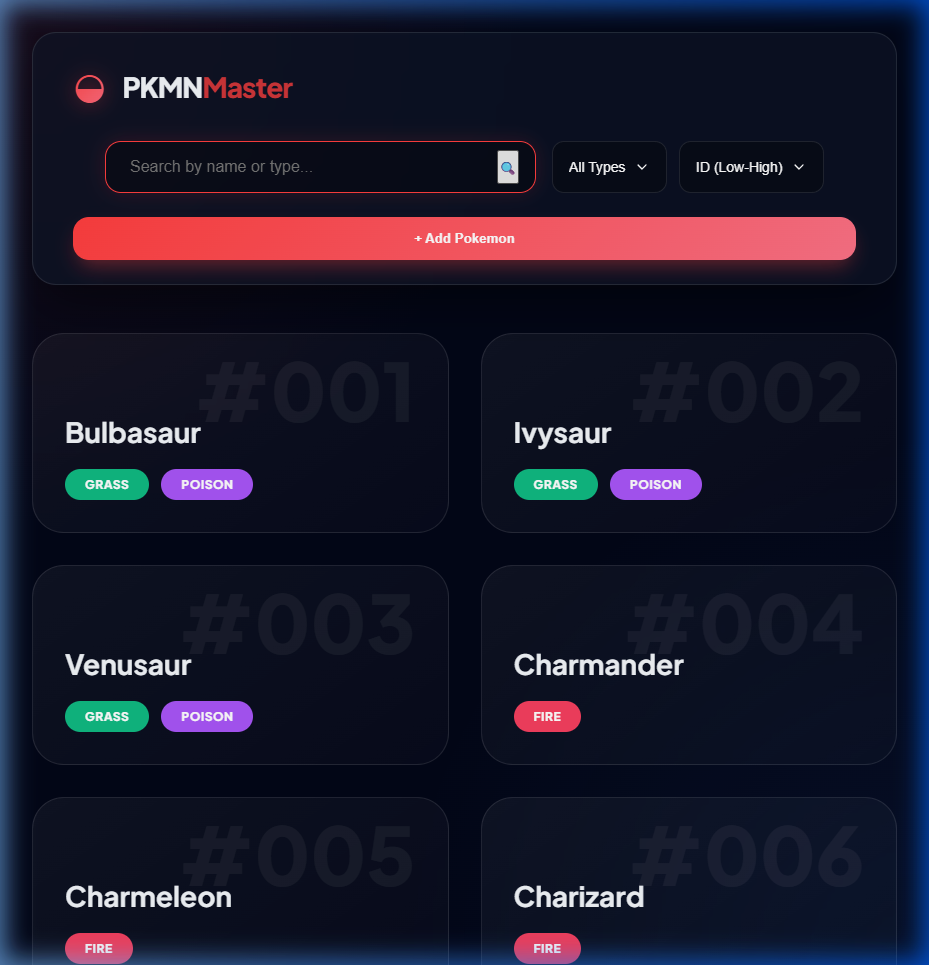
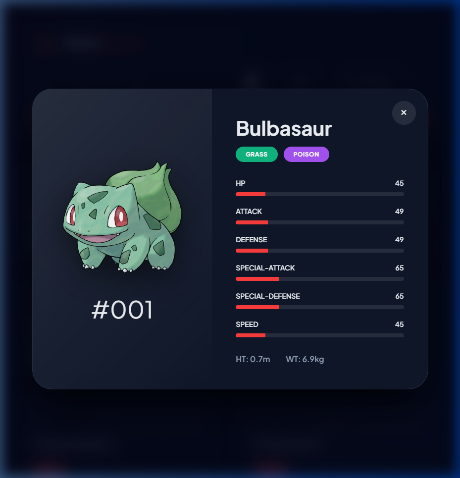

<div align="center">
  
  
  # ◒ PKMN Master
  
  **The ultimate professional-grade Pokemon management dashboard.**
  
  [](https://nodejs.org/)
  [](https://expressjs.com/)
  [](https://opensource.org/licenses/ISC)

  [Features](#-features) • [Installation](#-quick-start) • [Tech Stack](#-tech-stack) • [Screenshots](#-screenshots)

  ### 🔗 [Live Demo](https://brandonnnlc.github.io/school-bed-ca2-proj-/)
</div>

---

## 🚀 Features

- **💎 Premium UI**: A stunning glassmorphic interface built with modern CSS and GSAP animations.
- **⚡ PokeAPI Integration**: Real-time high-resolution sprites, base stats, height, and weight fetched dynamically.
- **🔍 Advanced Filtering**: Instant search by name or type with a responsive filtering system.
- **📊 Detailed Analytics**: View detailed base stats (HP, Attack, Defense, etc.) with animated progress bars for every Pokemon.
- **➕ Easy Management**: Simple and intuitive form to add new Pokemon to your local collection.

---

## 📸 Screenshots

### Dashboard Overview


### Detail View (PokeAPI Data)


---

## 🛠 Tech Stack

| Layer | Technologies |
| :--- | :--- |
| **Frontend** | Vanilla JS, Modern CSS (Glassmorphism), [GSAP](https://greensock.com/gsap/), [Lucide Icons](https://lucide.dev/) |
| **Backend** | [Node.js](https://nodejs.org/), [Express](https://expressjs.com/) |
| **Data** | CSV (Local Storage), [PokeAPI](https://pokeapi.co/) (External Data) |

---

## ⚡ Quick Start

### 1. Clone & Install
```bash
git clone https://github.com/Brandonnnlc/school-bed-ca2-proj-
cd school-bed-ca2-proj-
npm install
```

### 2. Launch
```bash
npm run dev
```

The app will be available at `http://localhost:3000`.

---

## 📁 Project Structure

- `public/` - Premium frontend assets (Glassmorphic CSS, JS Logic).
- `src/` - Backend logic and PokeAPI integration.
- `data/` - Local Pokemon storage (CSV).
- `server.js` - Express API server.
- `index.js` - Legacy CLI manager.

---

<div align="center">
  Built with ❤️ by Brandon
</div>
